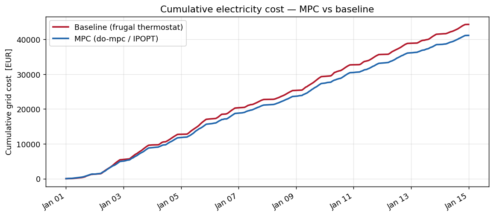
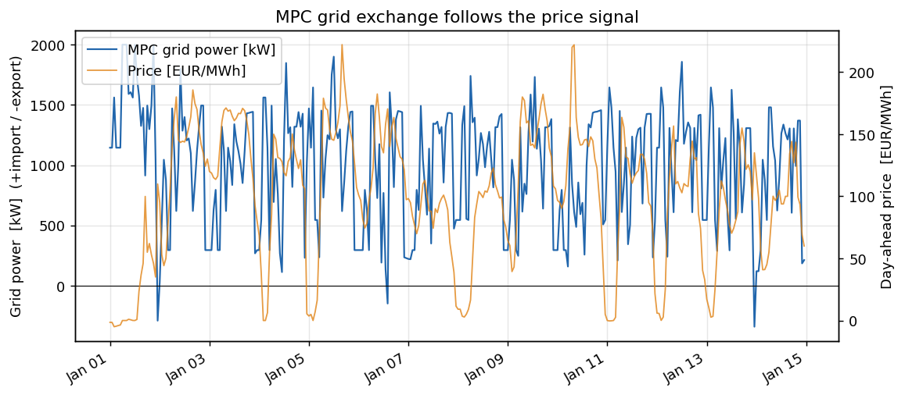
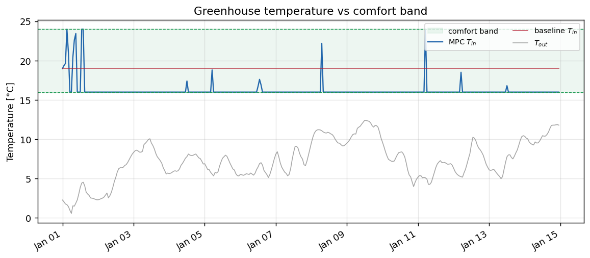
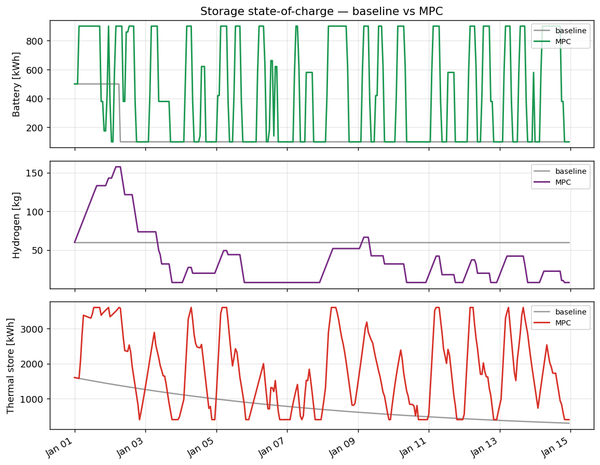
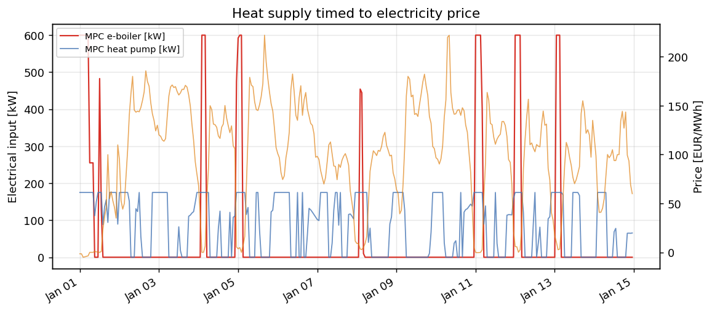
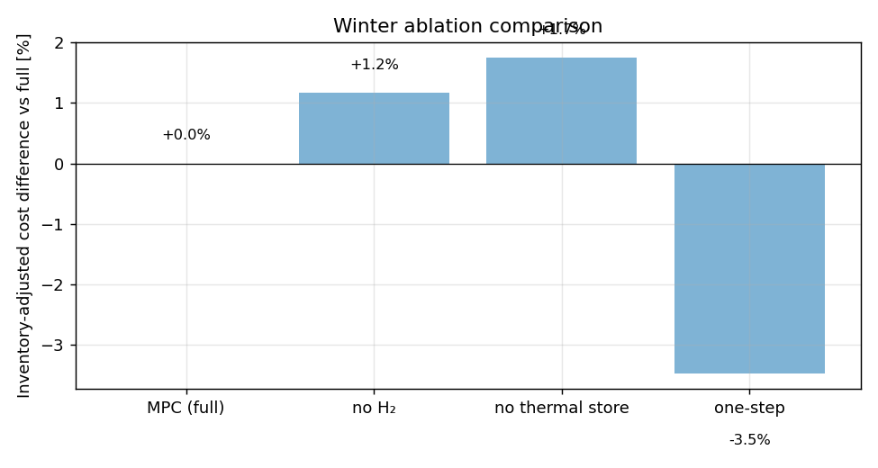

# Greenhouse Energy Hub MPC

Rolling-horizon economic **Model Predictive Control (MPC)** for a multi-carrier greenhouse energy hub (electricity, heat, hydrogen). The controller coordinates solar PV, a battery, a hydrogen electrolyser/fuel-cell buffer, a heat pump, an electric boiler and thermal storage against real Dutch day-ahead electricity prices, minimising operating cost while keeping the crop inside its temperature comfort band.

**System modelled:** a representative 1 ha (10,000 m²) high-tech, lit Dutch (Westland) tomato greenhouse.

---

## Motivation

Dutch greenhouses have historically provided grid flexibility through **Combined Heat and Power (CHP)** units,  gas engines producing electricity (sold to the grid) and heat (for the crop). As the Netherlands phases out fossil CHP, that dispatchable flexibility disappears. Replacing it requires an MPC-orchestrated multi-carrier hub combining:

- **Battery** — short-term price arbitrage and peak shaving
- **Electrolyser + H₂ tank + fuel cell** — a multi-day buffer; the *green analogue of the CHP* (surplus electricity → H₂ → electricity **and** heat on demand)
- **Heat pump + electric boiler + thermal store** — power-to-heat that decouples crop heating from the real-time electricity price
- **Predictive control** — exploiting day-ahead price forecasts and the crop's thermal comfort band as flexibility

This repo implements the **economic-dispatch layer** of that hub.

---

## Results

14-day rolling-horizon simulations use do-mpc / IPOPT with a 24-hour receding horizon, hourly steps, and perfect-foresight forecasts. The MPC is compared with a **limited-capability rule-based baseline** in the winter and summer scenarios.

The baseline's missing capabilities are declared explicitly in `BASELINE_CAPABILITY_POLICY` (`src/greenhouse_energy_hub/controllers/baseline.py`). Hydrogen dispatch, thermal-store charging and grid-battery charging are disabled. Battery discharge requires a price of at least €0.12/kWh. The reactive temperature target is 16.5 °C, and there is no look-ahead. **The MPC is subject to none of these restrictions** — the `no H₂` row in the ablation table below is a separate MPC variant, not the configuration used for the headline result.

Imports pay wholesale plus a transport/levy surcharge; exports earn wholesale.

<!-- BEGIN GENERATED RESULTS: DO NOT EDIT -->
| Window | Baseline Inventory-Adjusted Cost | MPC Inventory-Adjusted Cost | Saving (€) | Saving (%) | Comfort Violation (baseline / MPC) |
|--------|----------------------------------:|-----------------------------:|-----------:|:----------:|:-----------------------------------:|
| **Winter** | €45,389 | €42,560 | €2,829 | +6.2 % | 0.0 / 0.0 °C·h |
| **Summer** | €3,571 | €1,872 | €1,698 | +47.6 % | 29.6 / 28.6 °C·h |

| Winter ablation | Inventory-Adjusted Cost | Comfort Violation | Cost difference vs full |
|-----------------|--------------------------:|------------------:|:-----------------------:|
| MPC (full) | €42,560 | 0.0 °C·h | +0.0 % |
| no H₂ | €43,057 | 0.0 °C·h | +1.2 % |
| no thermal store | €43,303 | 0.0 °C·h | +1.7 % |
| one-step horizon | €41,082 | 2,826.4 °C·h | -3.5 % |

**Reproducibility.** The tables and figures use [verified Run Bundles](results/runs/) committed with the repository. The [publication manifest](results/publication_manifest.json) maps the published results and figures to their source runs, and the [publication tests](tests/test_published_artifacts.py) recompute the reported values.
<!-- END GENERATED RESULTS -->

The tables report **Inventory-Adjusted Cost** and **Comfort Violation** separately; they do not use a comfort-priced composite metric. These are simulation-prototype results, not decision-grade evidence for a specific site.

### Figures








### Ablation study



---

## System architecture

```
┌────────────────────────────────────────────────────────────────┐
│                     GREENHOUSE ENERGY HUB (1 ha)                 │
│                                                                  │
│  ☀ PV (500 kWp) ─────────────┐                                  │
│  🔋 Battery (1000 kWh/500 kW) ┤                                  │
│  ⚡ Electrolyser (250 kW) ────┤── Electricity bus ⇄ Grid (±2 MW) │
│  🔌 Fuel cell (200 kWe) ──────┤                                  │
│  🌡 Heat pump (175 kWe→612 kWth, COP 3.5)                        │
│  🔥 Electric boiler (600 kWe→594 kWth)                           │
│       │  🫙 H₂ tank (200 kg)                                     │
│       └──┴──▶ Heat bus ──▶ 🪣 Thermal store (4000 kWh) ──▶ Crop │
│  ☀ Solar gain (passive)   🍃 Ventilation (control)              │
│                                                                  │
│  🌡 Indoor temperature  T_in ∈ [16, 24] °C  (soft band)          │
└────────────────────────────────────────────────────────────────┘
            ▲ MPC — 24-hour receding horizon, hourly steps
            │ minimise: Σ price·P_grid·Δt + wear/cycling + band slack
            │ subject to: storage dynamics, electricity balance,
            │             power-to-heat balance, comfort band
```

Fuel-cell waste heat is recovered to the heat bus, so stored hydrogen returns **both** electricity and heat.

---

## MPC formulation

At each timestep *k* the controller solves a finite-horizon optimal control problem:

$$\min_{u_k,\ldots,u_{k+N-1}} \;\; \sum_{i=0}^{N-1}\Big[\; \underbrace{\lambda(k{+}i)\,P_{\text{grid}}\,\Delta t}_{\text{grid cost}} \;+\; \underbrace{c_{\text{wear}}(u)}_{\text{degradation}} \;+\; \underbrace{c_{\text{cmpl}}(u)}_{\text{anti-cycling}} \;+\; \underbrace{\rho\,s_T}_{\text{comfort slack}}\;\Big] \;-\; \underbrace{\beta\,V_{\text{stored}}(x_{k+N})}_{\text{terminal value}}$$

subject to

- **Storage dynamics** — battery SOC, H₂ inventory, thermal store, greenhouse temperature (implicit-Euler thermal node, unconditionally stable).
- **Electricity balance** — $P_{\text{grid}} + P_{\text{pv}} + P_{\text{bat,dis}} + P_{\text{fc}} = P_{\text{load}} + P_{\text{bat,ch}} + P_{\text{elz}} + P_{\text{hp}} + P_{\text{eb}}$. The grid is the **slack bus** (a derived expression), so the balance holds exactly by construction.
- **Asymmetric grid tariff** — imported energy pays wholesale price + a transport/levy surcharge; exports earn wholesale only. This breaks symmetric buy=sell arbitrage and tempers negative-price gaming. The import volume uses a smooth $\max(0, P_{\text{grid}})$ so the objective stays differentiable for IPOPT.
- **Power-to-heat feasibility** — the thermal store can only charge from generated heat.
- **Comfort band** — $T_{\text{in}}\in[16,24]\,°\mathrm{C}$ as a *soft* constraint (slack-penalised), so the problem stays feasible when summer solar gain physically exceeds ventilation capacity.
- **Anti-cycling** — per-kWh throughput costs plus a complementarity penalty eliminate simultaneous charge/discharge.
- **Terminal value** — end-of-horizon storage is valued at a price-based cost-to-go proxy (battery & H₂ at the horizon-average price; heat at the average *heating-hour* price ÷ COP, which is ≈ 0 in summer and so prevents pointless heat hoarding).

**Horizon** N = 24 h · **Step** Δt = 1 h · **Solver** IPOPT (via CasADi / do-mpc).

---

## Repository layout

```
greenhouse-energy-hub-mpc/
├── src/greenhouse_energy_hub/
│   ├── hub.py               # asset sizing, bounds, shared plant physics
│   ├── simulation.py        # rolling-horizon loop with run validation
│   ├── scenarios.py         # scenario clock, input alignment, provenance
│   ├── evaluation.py        # cost accounting, Run Bundles, verification
│   └── controllers/
│       ├── baseline.py      # limited-capability rule-based baseline
│       └── mpc.py           # do-mpc / CasADi controller
├── scripts/
│   ├── fetch_pvgis.py       # PV/weather acquisition (network)
│   └── fetch_prices.py      # day-ahead price acquisition (network)
├── data/source/             # committed input CSVs and provenance sidecars
├── experiments/
│   ├── run_scenario.py      # run one baseline or MPC scenario
│   ├── ablations.py         # full / no-H₂ / no-TES / one-step study
│   └── publish_results.py   # regenerate manifest, figures, README block
├── tests/
├── notebooks/results_analysis.ipynb
├── docs/                    # terminology and architecture decision records
├── pyproject.toml
└── results/
    ├── runs/                # immutable Run Bundles
    ├── publication_manifest.json
    └── figures/
```

---

## Installation and usage

Capitalised domain terms used from here on — Run, Run Specification, Run Bundle, Scenario, Operating Window — are defined in [`docs/terminology.md`](docs/terminology.md).

```bash
git clone https://github.com/victoronwuanaku/greenhouse-energy-hub-mpc
cd greenhouse-energy-hub-mpc
python -m pip install -e '.[dev]'
```

The committed files in `data/source/` (and their provenance sidecars) are the
retained reproduction inputs. Reproducing the published evidence does not need a
network refresh or the gitignored diagnostics candidate index:

```bash
python experiments/publish_results.py \
    --manifest results/publication_manifest.json
python -m pytest -o addopts='' -q -ra tests/test_published_artifacts.py
git diff --exit-code -- README.md results/publication_manifest.json results/figures
```

When `results/diagnostics/publication-candidates.json` is absent, the publisher
reconstructs all eight candidate roles from the tracked manifest. It then verifies
every full-ID Run Bundle and its causal semantics, and regenerates only the pinned
manifest, the six figures, and the marked README result block. The final `git diff`
checks that committed publication bytes remain unchanged.

### Optional input refresh

These commands fetch from the network and overwrite the committed input files. Use
them to start a new study, not to reproduce the committed publication: new source
hashes produce new Run Specification and Run Bundle IDs.

```bash
python scripts/fetch_pvgis.py
python scripts/fetch_prices.py
```

### Full publication Run generation

To generate a fresh candidate index, run the 14-day windows below. Each Scenario
carries 24 steps of forecast coverage beyond the operating window; the baseline
uses horizon zero, the full MPC uses horizon 24, and only the one-step ablation
changes the controller horizon.

The ablation command records `ablation-full`, `ablation-no-h2`,
`ablation-no-tes`, and `ablation-one-step`; together with the four explicit
comparison keys above, the candidate index has exactly the required eight roles.
Publish that newly generated index with:

```bash
python experiments/publish_results.py \
    --candidates results/diagnostics/publication-candidates.json \
    --manifest results/publication_manifest.json
python -m pytest -o addopts='' -q -ra
```

---

## Data sources

| Dataset | Source | Coverage |
|---------|--------|----------|
| Solar PV + weather | PVGIS-SARAH2 (EU JRC), Westland 52.0 °N 4.25 °E | 2020, hourly |
| NL day-ahead prices | energy-charts.info (Fraunhofer ISE / ENTSO-E) | 2023, hourly |
| Greenhouse electrical load | Synthetic: 12 W/m² base load plus a seasonal 06:00–22:00 LED schedule (≤120 W/m²) dimmed with irradiance (`scenarios.derive_electrical_demand`) | hourly, derived per scenario |

PV/weather (2020) and prices (2023) come from different years. The Scenario Module
validates exact hourly UTC source coverage and transplants PV/weather by
calendar instant onto each 2023 Operating Window; operating-clock schedules use
`Europe/Amsterdam`. This is a deliberate synthetic-study simplification. Heat demand
is **not** prescribed: it is implicit in the greenhouse temperature ODE.

---

## Tools and methods

| Tool | Role | Basis |
|------|------|-------|
| **do-mpc v5** | MPC formulation, rolling-horizon solver | Fiedler et al. (2023), *Control Eng. Practice* |
| **CasADi v3.7** | Symbolic differentiation, NLP generation | Andersson et al. (2019), *Math. Prog. Comp.* |
| **IPOPT** | Interior-point NLP solver | Wächter & Biegler (2006) |
| **PVGIS** | Solar irradiance + temperature data | EC Joint Research Centre |
| **Energy-hub framework** | Multi-carrier coupling | Geidl & Andersson (2007) |

---

## Key references

1. **Msaad, S., Harraway, M. & McAllister, R.D. (2025).** RL-Guided MPC for Autonomous Greenhouse Control. *arXiv:2506.13278*
2. **Fiedler, F. et al. (2023).** do-mpc: Towards FAIR nonlinear and robust MPC. *Control Engineering Practice, 140*, 105676.
3. **Geidl, M. & Andersson, G. (2007).** Optimal power flow of multiple energy carriers. *IEEE Trans. Power Syst. 22*(1), 145–155 — the energy-hub framework used in `src/greenhouse_energy_hub/hub.py`.
4. **El-Afifi, M.I., Eladl, A.A., El-Saadawi, M.M., Sedhom, B.E. & Osman, S.F. (2024).** Coordinated distributed model predictive control for multi energy carrier systems. *Scientific Reports, 14*, 27688. https://doi.org/10.1038/s41598-024-78314-5
5. **Andersson, J.A.E. et al. (2019).** CasADi: a software framework for nonlinear optimization and optimal control. *Math. Prog. Computation, 11*(1), 1–36.

---

## License

MIT — see [`LICENSE`](LICENSE).
